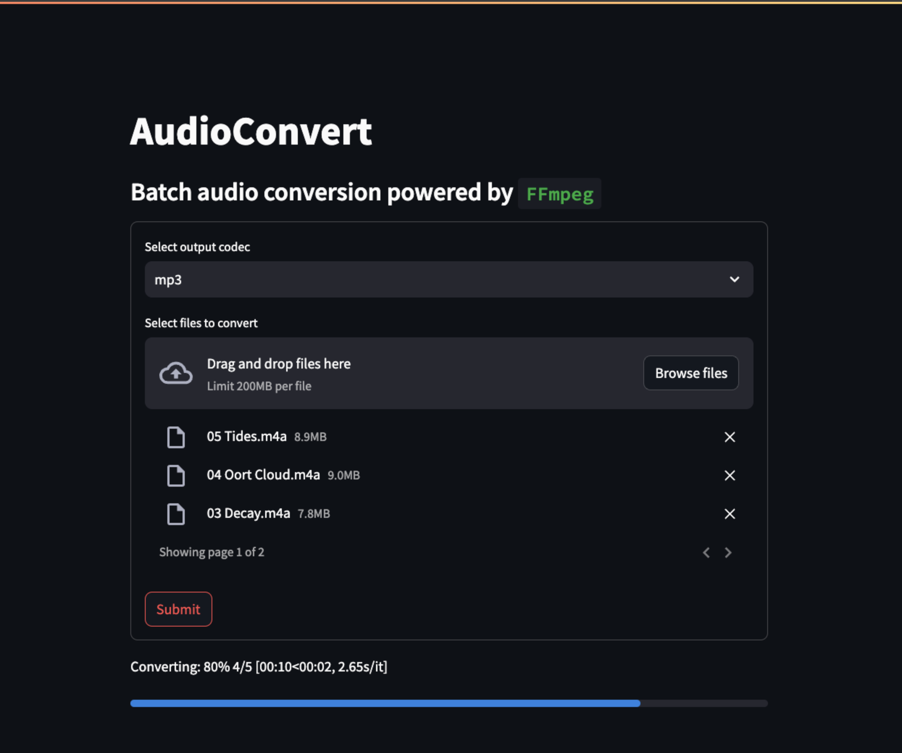

# `AudioConvert` – Batch audio conversion powered by `FFmpeg`

# Installation
First and foremost, `FFmpeg` must be [installed](https://ffmpeg.org/download.html).

Clone repo and install dependencies:
```sh
$ git clone https://github.com/prince-ravi-leow/AudioConvert
$ pip install -r audio_convert/requirements.txt
```

# Simple usage
## From terminal
```sh
$ python3 audio_convert.py --help 
usage: audio_convert.py [-h] input_directory output_codec

Simple example: python3 audio_convert.py 'HOME - Odyssey (2014)/' 'mp3'

positional arguments:
  input_directory  Input directory
  output_codec     Output codec

options:
  -h, --help       show this help message and exit

$ python3 audio_convert.py "HOME - Resonance (2014)" "mp3"
HOME - Odyssey (2014) | 09 Resonance.m4a:  67%|██████████████████████           | 8/12 [00:21<00:11,  2.78s/it]
```
## Interactive session
```py
from audio_convert import AudioConvert
c = AudioConvert(output_codec="mp3")
c.get_dir_files("/path/to/audio_files/")
c.convert()
```

# Run GUI
`AudioConvert` comes with a GUI built with [`streamlit`](https://github.com/streamlit/streamlit). 

Run a local version of the app like so:
```
$ streamlit run audio_convert/st_audio_convert.py
```
App preview: 

